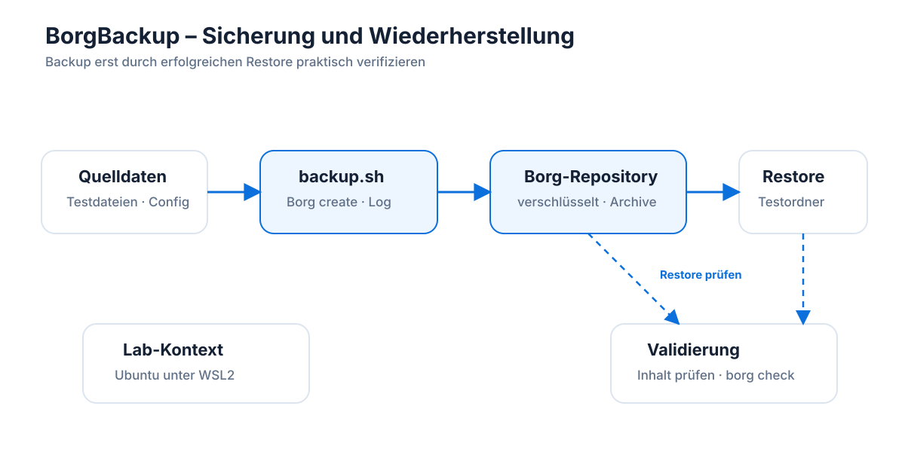

# Linux Borg Backup & Restore Lab

🇩🇪 Dieses Repository dokumentiert ein praktisches Backup- und Restore-Lab mit BorgBackup unter Linux.  
🇬🇧 This repository documents a practical Linux backup and restore lab using BorgBackup.

---

## 🇩🇪 Deutsch

## Ziel des Projekts

Dieses Lab zeigt einen einfachen, aber praxisnahen Backup- und Restore-Prozess mit BorgBackup unter Linux.

Der Fokus liegt nicht nur auf dem Erstellen eines Backups, sondern auf dem vollständigen Ablauf:

- verschlüsseltes Borg-Repository initialisieren
- Testdaten sichern
- vorhandene Backup-Archive anzeigen
- eine gelöschte Datei wiederherstellen
- den Restore prüfen
- das Repository mit `borg check` kontrollieren
- den Ablauf nachvollziehbar dokumentieren

## Laborumgebung

- Windows-Hostsystem
- Ubuntu unter WSL2
- BorgBackup
- Git
- lokale Testdaten ohne private oder produktive Inhalte

WSL2 steht für Windows Subsystem for Linux Version 2. Damit kann eine Linux-Umgebung direkt unter Windows genutzt werden.

## Architektur im Überblick

Die Grafik zeigt den vollständigen Lernpfad vom Ausgangsbestand über das automatisierte Backup in ein verschlüsseltes Borg-Repository bis zum getrennten Restore-Test und der abschließenden Validierung mit Inhaltsprüfung und `borg check`.

## Getestetes Szenario

In diesem Lab wurde ein typischer Betriebsfehler simuliert:

1. Eine Konfigurationsdatei wurde mit Borg gesichert.
2. Die Originaldatei wurde absichtlich gelöscht.
3. Die Datei wurde aus dem Borg-Archiv in einen separaten Restore-Test-Ordner wiederhergestellt.
4. Der Inhalt der wiederhergestellten Datei wurde geprüft.
5. Die Datei wurde zurück an den ursprünglichen Speicherort kopiert.
6. Das Borg-Repository wurde mit `borg check` geprüft.

## Wichtige Sicherheitsregeln

Dieses Repository darf keine sensiblen Daten enthalten.

Nicht in dieses Repository gehören:

- echte Backup-Repositories
- echte private Daten
- Borg-Passphrases
- SSH Private Keys
- Produktionsservernamen
- Kundendaten
- Datenbank-Dumps
- sensible Logdateien

Das lokale Borg-Repository `backup-repo/` wird über `.gitignore` ausgeschlossen.

## Version 1.1

Version 1.1 ergänzt ein erstes automatisiertes Backup-Skript:

- `scripts/backup.sh`
- Archivnamen mit Zeitstempel
- Logdatei pro Backup-Lauf
- automatische Anzeige vorhandener Archive nach dem Backup
- zusätzliche Dokumentation in `docs/backup-script.md`

Das Skript speichert keine Borg-Passphrase. Die Passphrase wird im Lab weiterhin interaktiv eingegeben.

## Aktueller Stand

Version 1.0 enthält:

- lokale Testdaten
- verschlüsseltes Borg-Repository
- erstes Backup-Archiv
- manuellen Restore-Test
- Integritätsprüfung mit `borg check`
- technische Dokumentation im Ordner `docs/`

## Wichtigste Erkenntnis

Ein Backup ist erst dann zuverlässig, wenn ein Restore erfolgreich getestet wurde.

---

## 🇬🇧 English Summary

## Project Goal

This repository documents a practical Linux backup and restore lab using BorgBackup.

The goal is to demonstrate a basic backup workflow:

- initialize an encrypted Borg repository
- create a backup archive
- list available archives
- restore deleted data
- verify restored content
- check repository integrity with `borg check`
- document the restore process

## Lab Environment

- Windows host system
- Ubuntu running in WSL2
- BorgBackup
- Git
- local test data only

WSL2 means Windows Subsystem for Linux version 2. It allows running a Linux environment directly on Windows.

## Tested Scenario

This lab simulates a simple operational incident:

1. A test configuration file was backed up.
2. The original file was deleted.
3. The file was restored from the Borg archive into a separate restore test directory.
4. The restored content was verified.
5. The file was copied back to its original location.
6. The Borg repository was checked with `borg check`.

## Security Notes

This repository must not contain:

- real backup repositories
- real private data
- Borg passphrases
- SSH private keys
- production server names
- customer data
- database dumps
- sensitive log files

The local Borg repository `backup-repo/` is excluded via `.gitignore`.

## Current Status

Version 1.0 includes:

- local test data
- encrypted Borg repository
- first backup archive
- manual restore test
- integrity check using `borg check`
- technical documentation in the `docs/` directory

## Key Lesson

A backup is only reliable after a restore has been successfully tested.
